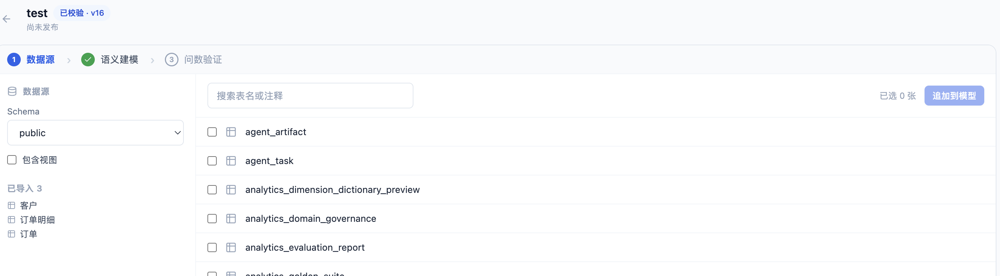
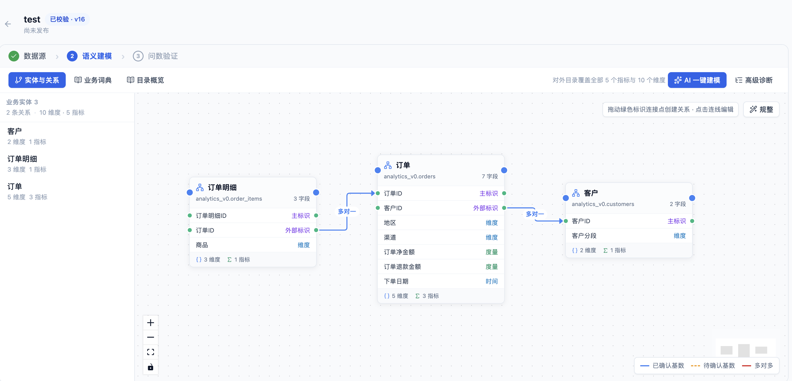
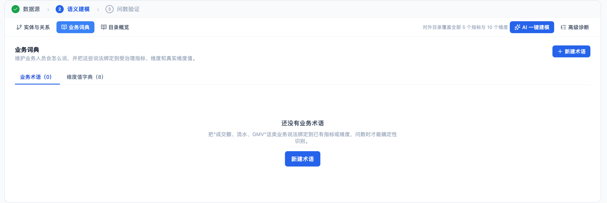
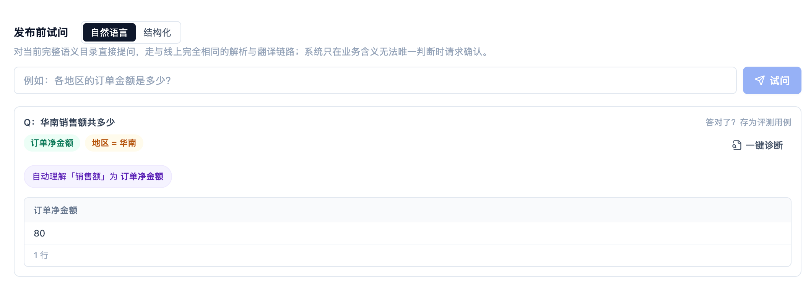
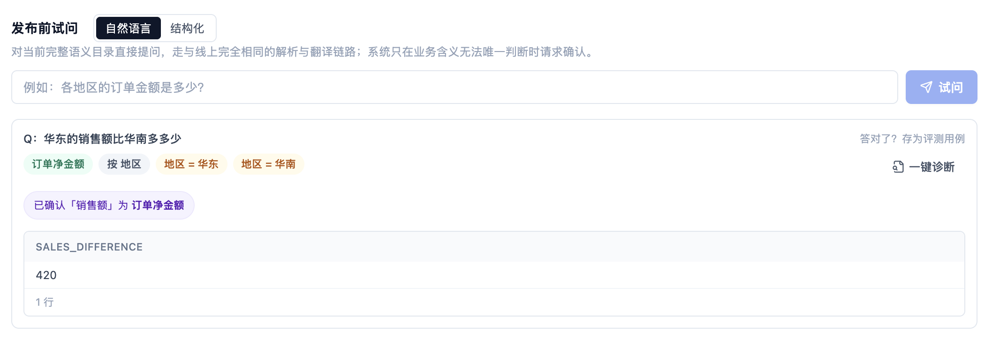
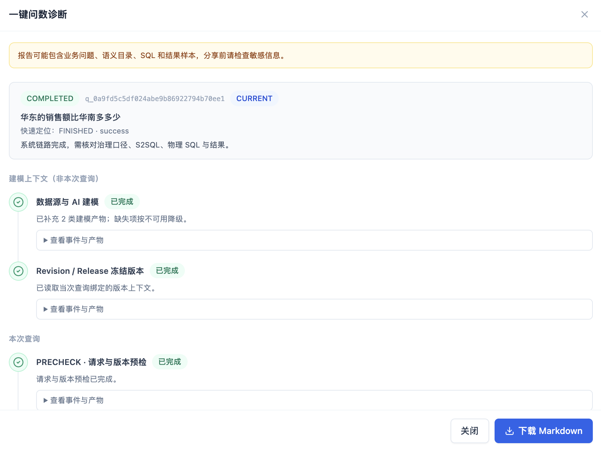

**今天，我们正式开源 KnowFlow Analytics。**

它是一套面向 AI Agent 与数据应用的**语义层和受治理查询引擎**，采用 Apache License 2.0。代码已经发布在 [GitHub](https://github.com/knowflow-ai/analytics)，也可以直接运行 Docker 镜像 [`knowflowai/analytics:v0.0.1`](https://hub.docker.com/r/knowflowai/analytics/tags?name=v0.0.1)。

我们做这件事，不是因为市场上还缺一个 Text-to-SQL Demo。恰恰相反，今天让大模型根据数据库 Schema 写出一条能执行的 SQL，已经不难。

> **真正难的是：** 当问数进入真实业务，如何保证“销售额”每次都指向同一个指标，Join 不会让金额翻倍，Agent、报表和 API 不会各自使用一套口径，以及模型不确定时不会悄悄返回一个看起来合理的错误数字。

这些问题靠继续堆 Prompt 和 Few-shot 很难根治。于是我们选择把最难、也最值得长期维护的部分，从模型上下文里拿出来，做成语义层。


---

## 为什么 Text-to-SQL 还需要语义层

传统做法通常是把表结构、字段注释、业务说明和几条 SQL 样例拼进 Prompt，再让 LLM 直接生成物理 SQL。它适合快速验证，却容易在业务扩大后失控：

- 同一个“销售额”，可能被写在三个 Agent 的三份 Prompt 里；
- 同一张订单表，在不同问题里可能被模型选出不同的 Join 路径；
- 一个新字段进入 Schema，也可能无意间改变线上查询范围；
- 遇到错误后补一条 Few-shot，往往只能修复相近问法。换个表达、组合两个指标，或者更换模型，问题又会回来。

Cube Core、Wren AI 等项目已经说明了一个重要方向：**指标、维度、关系和访问规则应该被定义一次，再交给 BI、应用和 Agent 复用。** KnowFlow Analytics 沿着这个方向继续向前走，把语义建模、自然语言问数、人工澄清、发布治理和查询诊断放进一条完整产品链。

在 KnowFlow 中：

- “销售额”“营收”“GMV”可以指向同一个受治理指标；
- 表之间的关系和基数需要经过确认；
- 一个问题能使用的事实根、成员和 Join 路径由编译器生成并随版本冻结。

**语义层维护好后，同一份 Release 可以同时服务自然语言问数、AI Agent、结构化查询 API、嵌入式应用和回归评测。**

> 这才是我们所说的泛化：不是鼓励模型在陌生业务里大胆猜测，而是在已经治理的业务范围内，让更多问法、更多组合和更多调用入口稳定复用同一份知识。

---

## 产品怎样把建模变成可落地的流程

### 从数据源开始建立业务模型

连接业务数据库后，KnowFlow 会读取 Schema，并允许用户选择真正需要进入语义层的表。业务数据仍留在原数据库中，系统维护的是经过治理的目录、版本和查询规则。



### AI 生成草案，人工确认关系

AI 可以生成实体名称、字段角色、指标、维度和别名草案。**AI 只负责提高建模效率，结果不会直接发布。**

用户可以在关系画布上确认实体与 Join 基数，逐项审核指标和业务词典，再通过结构校验和真实数据质量报告检查主标识、扇出、指标样本与关系可达性。



业务词典把“成交额”“流水”“GMV”等业务说法绑定到已治理的指标、维度与真实维度值，让同一份语义可以跨问题、跨 Agent 复用。



### 两个 Playground 验证同一份模型

发布前，系统提供结构化和自然语言两个 Playground。前者验证语义模型能否被正确翻译，后者验证用户说法能否映射到正确的业务定义。



模型通过验证后才生成**不可变 Release**，线上问题始终运行在已发布版本上，而不是随时变化的草稿上。

### 人工确认之后，系统才会记忆

歧义也不会被藏起来。如果“销售额”同时命中多个业务定义，页面会展示一张面向业务人员的确认卡。

只有用户完成选择、最终查询确实使用了该语义并成功执行后，系统才会写入确认记忆。记忆同时绑定用户、项目、Release、候选集、上下文和有效期；版本或上下文变化时自动失效。

**它记住的是一次有边界的业务确认，不是一条永远生效的 Prompt 补丁。**



---

## LLM 理解意图，编译器负责正确执行

KnowFlow 没有让 LLM 直接输出最终 SQL。完整查询依次经过五个阶段：

1. **Mapper**：把自然语言映射到已发布的业务名；
2. **Parser**：生成只包含业务名称的 S2SQL；
3. **Corrector**：检查成员、过滤、聚合和人工确认是否完整；
4. **Translator**：根据冻结的语义模型绑定物理字段与安全 Join 路径，编译参数化 SQL；
5. **Guard**：通过只读 AST 白名单、结果上限和执行超时后访问数据库。

> LLM 擅长理解“用户想问什么”，但指标公式、聚合方式、事实粒度和 Join 路径不应该每次都由它重新猜。

把这些规则交给确定性编译器后，更换模型不会顺带改变业务口径；Agent 也不再需要了解物理表名和字段名。如果成员、路径或版本无法被证明安全，系统会拒绝执行或请求澄清，而不是带着不确定性继续查库。

每次查询还有固定阶段的**一键诊断**，可以定位问题发生在映射、解析、校正、翻译还是执行，并导出脱敏 Markdown。对开发团队来说，这意味着问数系统终于可以像普通软件一样测试、定位和回归，而不是只能反复修改 Prompt 后凭感觉试问。



---

## 准确性，不只是“有多少题返回了结果”

我们目前用三套中文小型回归集跑完整产品链：从原始 PostgreSQL 导入、关系确认、AI 建模和发布，到发布后加载隐藏问题，再通过与浏览器一致的鉴权 API 发起自然语言查询，最后逐行对比参考 SQL 结果。

| 数据集 | 正确题数 | 准确率 | 静默错答 |
|---|---:|---:|---:|
| 电商集 | 12 / 12 | 100% | 0 |
| 城市与图书馆集 | 11 / 12 | 91.7% | 0 |
| 音乐 Holdout 集 | 9 / 12 | 75% | 0 |
| **合计** | **32 / 36** | **88.9%** | **0** |

> **更值得我们关注的是，三套测试的静默错答为 0。**

这个结果不是通用 Text-to-SQL 排行榜结论：题集规模仍小，当前数据源也只支持 PostgreSQL。我们公开它，是为了说明评测走的是用户实际经历的完整链路，而不是绕过建模与发布流程，直接向组件灌入整理好的语义数据。

失败会被记录、解释和继续修复；拒绝与澄清对用户可见，一个正常返回的错误数字却很难被发现。

---

## 为什么现在开源

语义层只有成为开放、可检查、可扩展的工程资产，才真正适合进入 Agent 生态。开发者应该能够：

- 查看查询管道；
- 验证每个阶段的输入输出；
- 替换兼容的模型端点；
- 增加新的数据源适配；
- 用自己的真实问题建立回归集，而不是把业务正确性寄托在一个黑盒接口上。

KnowFlow Analytics 现在仍处于早期阶段。PostgreSQL 之外的数据源、多用户权限以及更大规模的公开评测，都是接下来要补齐的部分。

但它已经把一条最重要的路径跑通了：**从数据库出发，建立可审核的语义模型，经过质量门禁发布，再把同一份业务语义稳定交给人、Agent 和应用使用。**

如果你正在做企业问数、数据 Agent、嵌入式分析，或者已经被不断膨胀的 Text-to-SQL Prompt 困扰，欢迎试用 KnowFlow Analytics。你可以提交 Issue、贡献适配器和契约测试，也可以把真实场景中的失败样本告诉我们。

```bash
git clone https://github.com/knowflow-ai/analytics.git
cd analytics
docker compose -f docker-compose.oss.yml up -d
```

启动后访问 <http://localhost:9395>。

**我们希望和开发者一起，把“能写 SQL”的 AI，变成真正理解并遵守业务语义的数据基础设施。**
